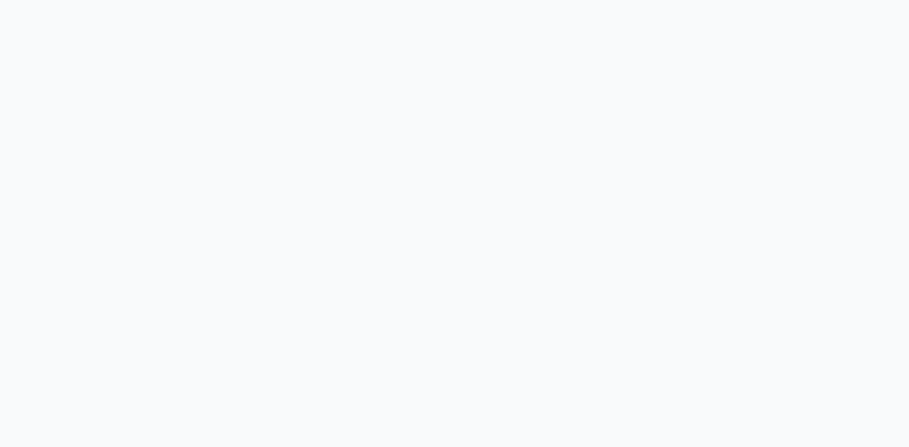

# Search Schedule Selector URL Synchronization

**ADW ID:** 0b90bdb0
**Date:** 2025-11-13
**Specification:** specs/feature-0b90bdb0-search-schedule-url-defaults.md

## Overview

This feature enhances the Search Schedule Selector (DaySelector) shared React component to default to Monday-Friday selections, synchronize user selections with URL parameters for shareable search links, and ensure schedule selections persist across page navigation. The implementation enables users to bookmark and share search URLs with specific schedule filters while maintaining backward compatibility with existing component usage.

## Screenshots

The screenshot above shows the search page on initial load, demonstrating the default Monday-Friday schedule selection and the `days-selected=1,2,3,4,5` URL parameter in the address bar.

## What Was Built

- **URL Parameter Synchronization in DaySelector**: Added optional `enableUrlSync` prop to enable reading from and writing to the `days-selected` URL parameter
- **Monday-Friday Default Selection**: Implemented default selection of weekdays (indices 1-5) at the component level when no URL parameter or parent control exists
- **SearchPage Integration**: Updated SearchPage to enable URL synchronization for the DaySelector component
- **HomePage Redirect Enhancement**: Modified "Explore Rentals" navigation to include schedule selections in the URL
- **URL Parameter Documentation**: Added comprehensive inline documentation explaining the 0-based indexing format

## Technical Implementation

### Files Modified

- `app/src/islands/shared/DaySelector.jsx`: Added URL parameter synchronization logic with `enableUrlSync` prop, internal state management for self-controlled mode, and Monday-Friday default selection from constants
- `app/src/islands/pages/SearchPage.jsx`: Enabled URL sync by passing `enableUrlSync={true}` to DaySelector component
- `app/src/islands/pages/HomePage.jsx`: Updated "Explore Rentals" button to include `days-selected` parameter in redirect URL, ensured consistent 0-based indexing across all schedule-related redirects
- `app/src/lib/urlParams.js`: Enhanced documentation for `parseDaysParam()` function with explicit 0-based indexing format and examples

### Key Changes

- **Component State Management**: Introduced dual-mode state handling where DaySelector can be either parent-controlled (via `selected` prop) or self-controlled (via internal state synced to URL)
- **URL Parameter Format**: Standardized on `days-selected=1,2,3,4,5` format using 0-based indexing (0=Sunday, 6=Saturday) matching JavaScript's day numbering
- **Browser History Integration**: Implemented `window.history.replaceState()` to update URLs without polluting browser history, ensuring clean back/forward navigation
- **Default Selection Logic**: Priority order is: parent-provided prop → URL parameter (if enableUrlSync) → defaultSelected constant (Monday-Friday)
- **Backward Compatibility**: `enableUrlSync` defaults to `false`, ensuring existing DaySelector implementations continue working without modification

## How to Use

### For End Users

1. **Default Behavior**: Navigate to the search page - Monday through Friday will be pre-selected automatically
2. **Custom Selection**: Click day buttons to toggle selection, URL will automatically update to reflect your choices (e.g., `?days-selected=0,6` for weekends)
3. **Share Links**: Copy the URL from your browser and share it - recipients will see the same schedule selection
4. **Bookmark Searches**: Bookmark search pages with specific schedules for quick access to common rental patterns
5. **Navigate from Home**: Select schedule preferences on the home page and click "Explore Rentals" - your selection carries over to the search page

### For Developers

1. **Enable URL Sync**: Add `enableUrlSync={true}` prop to DaySelector component to enable URL parameter synchronization
2. **Custom Defaults**: Pass `defaultSelected={[0,6]}` prop to change the default selection (e.g., weekends instead of weekdays)
3. **Parent Control**: Provide `selected` prop to maintain full parent control over selection (URL sync will be bypassed)
4. **URL Parameter Format**: Use `days-selected=1,2,3,4,5` format with 0-based indexing in URLs

## Configuration

### Component Props

- `enableUrlSync` (boolean, default: `false`): Enable URL parameter reading/writing
- `defaultSelected` (number[], default: `[1,2,3,4,5]`): Default selection when no URL parameter and no parent control
- `selected` (number[], optional): Parent-controlled selection (overrides URL and defaults)

### URL Parameter

- **Parameter Name**: `days-selected`
- **Format**: Comma-separated day indices using 0-based numbering
- **Example**: `?days-selected=1,2,3,4,5` (Monday-Friday)
- **Day Mapping**: 0=Sunday, 1=Monday, 2=Tuesday, 3=Wednesday, 4=Thursday, 5=Friday, 6=Saturday

## Testing

### Manual Testing Steps

1. Navigate to `/search.html` and verify Monday-Friday is selected by default with URL showing `?days-selected=1,2,3,4,5`
2. Change schedule selection by clicking days and verify URL updates in real-time
3. Copy URL with schedule parameter, open in new tab, and verify selection is restored
4. Use browser back button after changing schedule and verify previous selection is restored
5. Navigate to home page, select days, click "Explore Rentals", and verify redirect includes schedule parameter
6. Test invalid URL parameters (e.g., `?days-selected=999`) and verify fallback to Monday-Friday default
7. Verify schedule selector works alongside other filters (borough, neighborhoods, price) without conflicts

### Edge Cases Covered

- Malformed URL parameters fall back to Monday-Friday default
- Out-of-range day indices are filtered out during parsing
- Empty `days-selected` parameter is treated as missing and uses default
- Rapid selection changes update URL without performance degradation
- Parent-controlled components ignore URL parameters correctly

## Notes

### Implementation Highlights

- **State Priority**: Parent `selected` prop always takes precedence over URL parameters, maintaining full parent control when needed
- **History API Strategy**: Uses `replaceState()` instead of `pushState()` to avoid creating excessive browser history entries during selection changes
- **Initialization Optimization**: URL parameter is parsed only once on component mount, subsequent changes come from user interaction
- **Error Handling**: Invalid URL parameters are caught and logged, then fall back gracefully to default selection

### Browser Compatibility

The feature uses standard Web APIs (`URLSearchParams`, `window.history.replaceState()`) with broad browser support. No polyfills required for modern browsers.

### Future Enhancements

- Consider adding URL parameter debouncing if performance issues arise with extremely rapid selection changes
- Could add analytics tracking to measure URL sharing adoption
- Potential for schedule preset buttons to generate shareable URLs directly
