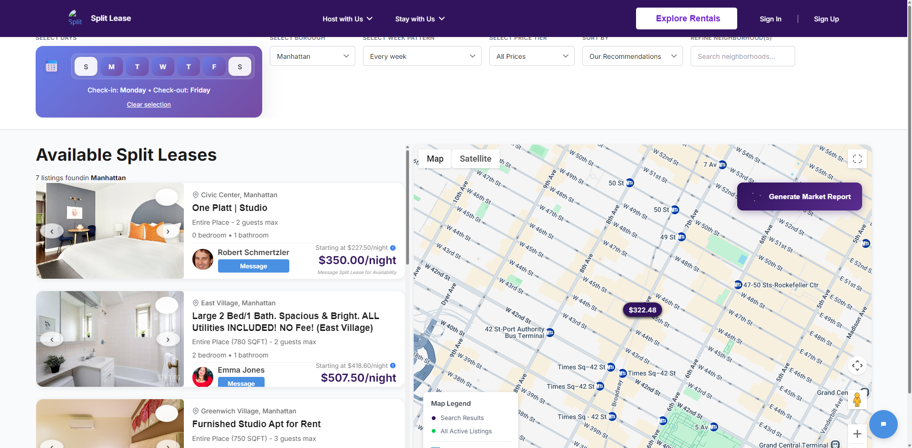
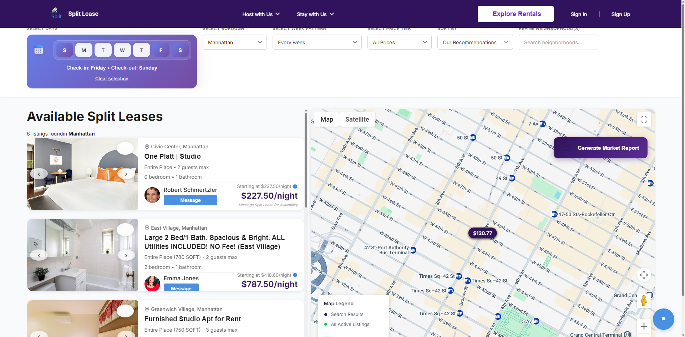
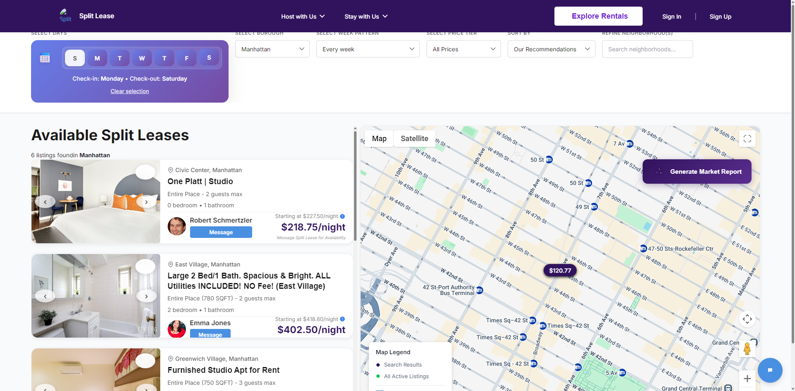

# Search Schedule Selector: Default Monday-Friday with URL Synchronization

**ADW ID:** 4
**Date:** 2025-11-13
**Specification:** specs/feature-4-7da19740-update-search-schedule-defaults.md

## Overview

Refactored the DaySelector component to be self-managing with built-in URL synchronization. The component now defaults to Monday-Friday selection, reads day selections from URL parameters on mount, writes changes back to the URL, and ensures seamless navigation from the HomePage to SearchPage with preserved day selections.

## Screenshots



*The DaySelector now defaults to Monday-Friday (weeknight stays) when no URL parameter is present*



*The DaySelector correctly reads from the URL parameter `days-selected=5,6,0` and displays Friday-Sunday selection*



*When users change their day selection, the URL parameter updates immediately to reflect the new state*

## What Was Built

- **Self-Managing DaySelector Component**: Component now manages its own state internally instead of relying on parent components
- **URL Reading**: Reads `days-selected` parameter on mount using 0-based indexing (0=Sunday, 1=Monday, etc.)
- **URL Writing**: Updates URL parameter automatically when user changes selection
- **Monday-Friday Default**: Uses [1,2,3,4,5] as default when no URL parameter exists
- **HomePage Integration**: "Explore Rentals" button now passes day selections via URL to SearchPage
- **0-Based Indexing Consistency**: Removed Bubble-specific conversion logic, now uses consistent 0-based indexing throughout

## Technical Implementation

### Files Modified

- `app/src/islands/shared/DaySelector.jsx`: Core component refactored to be self-managing with URL synchronization
  - Added imports for `parseUrlToFilters`, `updateUrlParams` from `urlParams.js`
  - Added import for `DEFAULTS` from `constants.js`
  - Replaced `selected` prop with internal state management using `useState`
  - Added `useEffect` hook to sync state changes to URL parameter
  - Reads URL parameter on initial mount and falls back to Monday-Friday default
  - Removed dependency on parent-provided `selected` prop

- `app/src/islands/pages/SearchPage.jsx`: Simplified by delegating URL sync to DaySelector
  - Removed URL synchronization logic for `selectedDays` (now handled by DaySelector)
  - Removed `isInitialMount` flag (no longer needed)
  - Simplified `useEffect` for URL parameter updates to exclude `selectedDays`
  - Changed URL update strategy to use `replaceState` instead of `pushState` for non-day filters
  - Removed `selected` prop from DaySelector usage

- `app/src/islands/pages/HomePage.jsx`: Removed Bubble-specific conversion logic
  - Removed import of `toBubbleDays` and `fromBubbleDays` utility functions
  - Updated `readDaysFromUrl()` to parse 0-based indexing directly
  - Updated `writeDaysToUrl()` to write 0-based indexing to URL
  - Updated `handleExploreRentals()` to pass 0-based day indices to SearchPage

### Key Changes

1. **Component-Level State Management**: DaySelector now owns its selection state instead of receiving it as a prop, making it truly reusable across different pages without parent coordination

2. **Bidirectional URL Sync**: The component reads from the URL on mount and writes to the URL on every selection change, enabling deep linking and URL sharing

3. **Smart Default Handling**: When no URL parameter exists, the component automatically defaults to Monday-Friday [1,2,3,4,5], the most common rental pattern

4. **Simplified Parent Components**: SearchPage and HomePage no longer need to manage URL synchronization for day selection, reducing coupling and code complexity

5. **Consistent 0-Based Indexing**: Eliminated Bubble-specific 1-based indexing conversion logic, unifying the codebase around JavaScript's native 0-based day indexing

## How to Use

### As a User

1. **Default Selection**: When you visit `/search.html` without any parameters, Monday-Friday will be pre-selected automatically

2. **URL Parameters**: Navigate to `/search.html?days-selected=5,6,0` to see a Friday-Sunday selection (using 0-based indexing where 0=Sunday)

3. **Changing Selection**: Click days in the DaySelector to toggle them on/off. The URL will update immediately to reflect your changes

4. **Sharing Links**: Copy the URL from your browser's address bar to share your exact day selection with others

5. **HomePage Navigation**: Select days on the homepage and click "Explore Rentals" - your selection will carry over to the search page

### As a Developer

1. **Using DaySelector**:
```jsx
<DaySelector
  onChange={(selectedDays) => {
    // Receive callback when selection changes
    // URL is already updated by the component
    console.log('Days changed to:', selectedDays);
  }}
  label="Select Days"
/>
```

2. **No `selected` Prop Required**: The component manages its own state internally

3. **URL Format**: Days are stored as comma-separated 0-based indices: `?days-selected=1,2,3,4,5`

## Configuration

### Default Days

The default selection is defined in `app/src/lib/constants.js`:

```javascript
DEFAULTS.DEFAULT_SELECTED_DAYS = [1,2,3,4,5]; // Monday-Friday
```

To change the default, modify this constant. The DaySelector will automatically use it when no URL parameter is present.

### URL Parameter Name

The URL parameter is hardcoded as `days-selected` in the `urlParams.js` utility functions. This name is used consistently across HomePage, SearchPage, and DaySelector.

### Validation Rules

- **Minimum Nights**: Controlled by `minDays` prop (default from spec)
- **Contiguity**: Controlled by `requireContiguous` prop (default: true)
- These validation rules remain enforced within the DaySelector component

## Testing

### Manual Testing Checklist

1. **Default Selection Test**:
   - Navigate to `/search.html` → Should show Monday-Friday selected
   - URL should not have `days-selected` parameter (or show default)

2. **URL Reading Test**:
   - Navigate to `/search.html?days-selected=5,6,0` → Should show Friday-Sunday selected
   - Navigate to `/search.html?days-selected=1,2,3` → Should show Monday-Wednesday selected

3. **URL Writing Test**:
   - Change selection in DaySelector → URL should update immediately
   - Check browser address bar for `days-selected` parameter

4. **Browser Navigation Test**:
   - Change selection → Use browser back button → Selection should revert
   - Use browser forward button → Selection should restore

5. **HomePage Integration Test**:
   - Select days on homepage → Click "Explore Rentals"
   - SearchPage should show the same days selected
   - URL should contain correct `days-selected` parameter

6. **Invalid URL Test**:
   - Navigate to `/search.html?days-selected=abc` → Should fall back to Monday-Friday
   - Navigate to `/search.html?days-selected=7,8,9` → Should fall back to Monday-Friday
   - No console errors should appear

### Edge Cases Covered

- Empty URL parameter → Falls back to Monday-Friday default
- Invalid day values → Filtered out, falls back to default if none valid
- Out-of-range values (>6) → Filtered out
- Malformed parameter → Handled gracefully with fallback
- Browser back/forward → Correctly syncs with URL state

## Notes

### Architecture Decision

**Why Self-Managing?**
Previously, the DaySelector relied on parent components to provide the `selected` prop and manage URL synchronization. This created tight coupling and made the component harder to reuse. By making it self-managing:
- Component is truly reusable without parent coordination
- Single source of truth (URL parameter)
- Reduced code duplication between HomePage and SearchPage
- Clearer separation of concerns

**Trade-offs:**
- Component is now more opinionated (owns its state)
- Parents can't fully control selection via props (URL is the API)
- This is intentional: URL is the single source of truth for day selection

### 0-Based Indexing Consistency

The project previously used Bubble's 1-based day indexing (1=Sunday) on the HomePage, requiring conversion functions `toBubbleDays` and `fromBubbleDays`. This feature eliminated that inconsistency:
- All components now use JavaScript's native 0-based indexing (0=Sunday, 1=Monday, etc.)
- URL parameters use 0-based indexing
- Constants use 0-based indexing
- No conversion logic required between pages

### Future Enhancements

1. **URL Debouncing**: Consider debouncing URL updates (300-500ms) to avoid spamming browser history during rapid selection changes

2. **Preset Schedules**: Add quick preset buttons for common patterns (Weeknights, Weekends, Full Week)

3. **URL Shorthand**: Support human-readable shortcuts like `?schedule=weeknight` → [1,2,3,4,5]

4. **Analytics**: Track most popular day selections to validate if Monday-Friday default is optimal

### Related Features

- **Issue #1**: Search page port (predecessor, already completed)
- **Issue #2**: Favorite persistence (may need URL sync for favorites)
- Listing price calculation depends on day selection
- Map marker pricing depends on day selection
